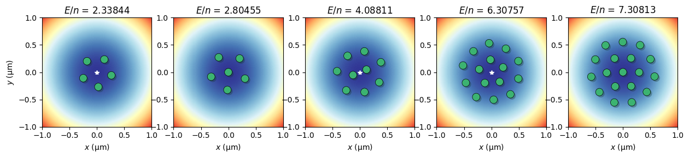

# Quantum electron solver
This package has two main functions
1. It can simulate electron positions in a two dimensional plane for electrons confined in an electrostatic potential. The electron-electron interactions are also taken into account.
2. It can solve the Schrodinger equation for a single electron confined in an electrostatic potential.

In both cases there are methods to calculate couplings to a resonator and resonator frequency shifts due to electrons. This is useful the electrons are detected with a microwave resonator. If your experimental setup does not contain a resonator, you can safely ignore the methods in this library without compromise of the results. 

After installation, it is advised to take a look at the `examples` folder to explore some of the functionalities of this module. 



## Installation

Clone this module in a directory of your choice

```
git clone https://github.com/gkoolstra/quantum_electron.git
```
In a terminal window, change into the cloned directory:
```
cd quantum_electron
pip install -e .
```


## Getting started
The best way to learn how to use the module is to browse the examples. At a very high level this is the workflow:

To solve for the positions of the electrons, one can now use the following sets of short commands:
```
from quantum_electron import FullModel
f = FullModel(potential_dict, voltages, **options)
f.periodic_boundaries = ['x']

N = 58
initial_condition = f.generate_initial_condition(N)
init_x, init_y = r2xy(initial_condition)
    
res = f.get_electron_positions(n_electrons=N, electron_initial_positions=initial_condition, verbose=False)

f.plot_electron_positions(res)
```

There are a number of options that influence the solution of the minimization problem. Here is a dictionary of options that can be passed to `FullModel` to get started: 
```
options = {"f0" : 4e9, # Resonance frequency for the resonator (only used for solving motional frequencies)
           "Z0" : 50.0, # Resonator impedance (only used for solving motional frequencies)
           "include_screening" : True, # Include screening of electron-electron interactions due to thin film.
           "screening_length" : 2e-6, # Typically helium thickness.
           "potential_smoothing" : 5e-4, # Numerical smoothing of the splines (gets rid of some noise, can introduce artifacts)
           "remove_unbound_electrons" : False, # Removes electrons if they shot outside the solution box.
           "remove_bounds" : None, # Sets which electrons should be removed if above is True.
           "trap_annealing_steps" : [0.1] * 10, # List of annealing temperatures, length determines the number of steps
           "max_x_displacement" : 0.1e-6, # Maximum x-displacement of solved electron positions during annealing.
           "max_y_displacement" : 0.1e-6} # Maximum y-displacement of solved electron positions during annealing.
```


## Tips for the initial condition
The initial condition can affect the final minimization result quite strongly. If there are issues with convergence you can first check convergence with `f.plot_convergence()`. A good final value for the cost function is ~1-500 eV/m. If the lowest value of the cost function is signifantly higher than this, or if warnings appear, here are some rules of thumb for successful convergence:
1. Don't create an initial condition where too many electrons are placed in a small area.
2. Don't place electrons in an initial condition where the potential is too flat, such as on a ground plane. 
3. Be mindful of electron sinks, i.e. channels for electrons to escape. These can appear if an electrode is adjacent to the ground plane, and has an applied voltage that is more positive than the ground plane.

