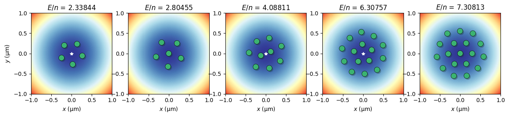
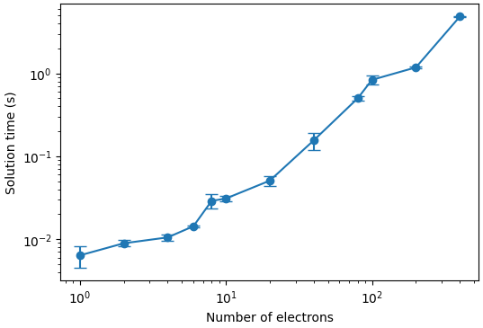

# Quantum Electron Solver

## Main use cases
This package has two main functions
1. It simulates electron positions in a two dimensional plane for electrons confined in an electrostatic potential $\phi$. Electron-electron interactions are also taken into account. Physically, it minimizes the total energy of an $N$-electron system, which is given by $ -e\sum_i \phi(\mathbf{r}_i) + \sum_{i<j} \frac{e^2}{4 \pi \epsilon_0} \frac{1}{|\mathbf{r}_i - \mathbf{r}_j|}$.

2. It calculates properties of in-plane electron modes. This is useful in two cases: (a) the electron motional states can be used for quantum computation, and this package can help to determine eigenfrequencies and eigenvectors of electron clusters (b) in the large $N$ limit the electron motional modes are also known as plasmons. There is an abundance of literature about these charge density waves, and many of the properties can be reproduced with this module.

### Features
- Robust operation through the use of the `scipy.optimize.minimize` library. We assure proper and fast convergence because the force (gradient of the energy) is supplied as an argument of the minimizer.
- Supply arbitrary potential energies $\phi$, as long as they're on a rectangular grid. 
- Handles problems up to $N \approx 400$ electrons in less than 1 minute on a laptop computer. 
- Periodic boundary condition support for systems with open boundaries.
- Seemless integration with finite element modeling software ZeroHeliumKit.



## Installation

Clone this module in a directory of your choice

```
git clone https://github.com/gkoolstra/quantum_electron.git
```
In a terminal window, change into the cloned directory:
```
cd quantum_electron
pip install -e .
```
After installation, it is advised to take a look at the `examples` folder to explore some of the functionalities of this module. 

### Additional packages
To generate animations, this module relies on `ffmpeg`. On MacOS this can be easily installed using [homebrew](https://formulae.brew.sh/formula/ffmpeg) from the Terminal. On Windows it can be installed using the following [link](https://www.ffmpeg.org/download.html). 

This module also integrates well with the output of the FEM software [ZeroHeliumKit](https://github.com/eeroqlab/zeroheliumkit). Please refer to any dependencies for ZHK on the linked github page.

## Tests
To test the performance of the minimization, we're building and expanding a suite of tests based on the `pytest` framework. To run these tests, `cd` into the main module directory and run `pytest`. Currently, we have implemented a test in `test_wigner_molecules.py`, which compares the energy per particle of Wigner molecules in a parabolic confinement to known tabulated values.

## Getting started
The best way to learn how to use the module is to browse the examples. At a very high level this is the workflow:

To solve for the positions of the electrons, one can now use the following sets of short commands:
```
from quantum_electron import FullModel
f = FullModel(potential_dict, voltages, **options)
f.periodic_boundaries = ['x']

N = 58
initial_condition = f.generate_initial_condition(N)
init_x, init_y = r2xy(initial_condition)
    
res = f.get_electron_positions(n_electrons=N, electron_initial_positions=initial_condition, verbose=False)

f.plot_electron_positions(res)
```

There are a number of options that influence the solution of the minimization problem. Here is a dictionary of options that can be passed to `FullModel` to get started: 
```
options = {"include_screening" : True, # Include screening of electron-electron interactions due to thin film.
           "screening_length" : 2e-6, # Typically helium thickness.
           "potential_smoothing" : 5e-4, # Numerical smoothing of the splines (gets rid of some noise, can introduce artifacts)
           "remove_unbound_electrons" : False, # Removes electrons if they shot outside the solution box.
           "remove_bounds" : None, # Sets which electrons should be removed if above is True.
           "trap_annealing_steps" : [0.1] * 10, # List of annealing temperatures, length determines the number of steps
           "max_x_displacement" : 0.1e-6, # Maximum x-displacement of solved electron positions during annealing.
           "max_y_displacement" : 0.1e-6} # Maximum y-displacement of solved electron positions during annealing.
```

## Tips for the initial condition
The initial condition can affect the final minimization result quite strongly. We encourage you to take a look at the example notebook about initial conditions. If there are issues with convergence you can first check convergence with `f.plot_convergence()`. A good final value for the cost function is ~1-500 eV/m. If the lowest value of the cost function is signifantly higher than this, or if warnings appear, here are some rules of thumb for successful convergence:
1. Don't create an initial condition where too many electrons are placed in a small area.
2. Don't place electrons in an initial condition where the potential is too flat, such as on a ground plane. 
3. Be mindful of electron sinks, i.e. channels for electrons to escape. These can appear if an electrode is adjacent to the ground plane, and has an applied voltage that is more positive than the ground plane.

## Contributing
Contributions to this growing repository are welcome. Please feel free to create a fork and create a pull request with your suggested changes.

## Credit
If you found this module useful in your research, please consider citing this code in your publication using a hyperlink.

## To-do list
- [ ] Standardize units of the arguments. Sometimes it is unclear whether to use microns or meters.
- [ ] Figure out how to handle warning messages for convergence issues. Why do problems sometimes have a hard time converging?
- [ ] Split off the Schrodinger solver?